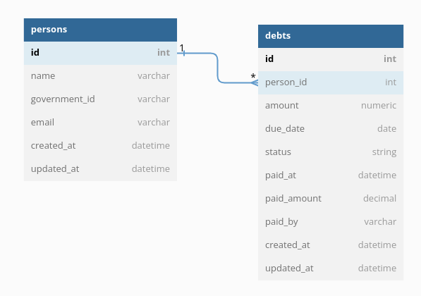

# Banki

Rest API built using [FastAPI](https://fastapi.tiangolo.com).

## Project Structure

```text
├── alembic -> migrations files
├── banki
│   ├── api -> api definitions (handlers, schemas)
│   ├── entities -> domain entities
│   ├── extensions -> modules which can be extracted as a lib and it's not a
│   ├── gateways -> everything that's outbound to our application lives here (db, api)
│   │   ├── db -> all db model, logics, configs
│   │   │   ├── models
│   │   │   └── repos
│   │   └── email -> email related things
│   ├── main.py -> main file which glues everything together
│   ├── use_cases -> domain business action
│   └── vo -> value objects
└── tests -> test for application (unit, integration)
```

## Project setup

This project uses [Poetry](https://python-poetry.org) as a dependency manager! It's very easy to use.

Once you have installed it, run:
```shell
poetry install # it'll install all the dependencies (normal and dev)
```

## Project Run

### On Docker Local

To simply run with docker execute the command below:
```shell
docker-compose -f docker/local/docker-compose.yml up --build
```

It'll build the api image and up a database for us! After that you can access the API:
- Swagger: [http://localhost:8000/docs](http://localhost:8000/docs)
- Redoc: [http://localhost:8000/redoc](http://localhost:8000/redoc)
- Mailhog: [http://localhost:7001](http://localhost:7001)

## On local

To run local without docker first you need to setup the project, back to [Project Setup](#project-setup) session
if you haven't done yet.

If you prefer to run only PostgreSQL on container, run:
```shell
docker-compose -f docker/local_dev/docker-compose.yml up -d
```

But if you want another way don't forget to set `SQLALCHEMY_DB_URI` env variable correctly.

Run the migration and then the app:
```shell
SQLALCHEMY_DB_URI="URI" make migration-up
make run-app
```

## Database Model

> You can also copy the content of [db.txt](db.txt) and past on [dbdiagram.io](https://dbdiagram.io/d)



## Future Improvements

* Use the beautiful FastAPI support for coroutines (aka async/await)
* Improves integration tests
